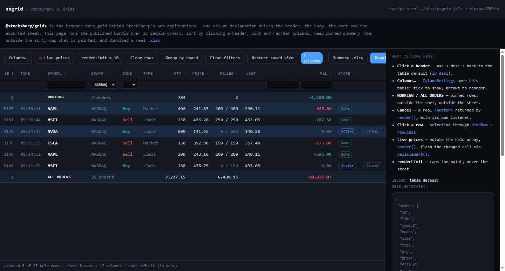
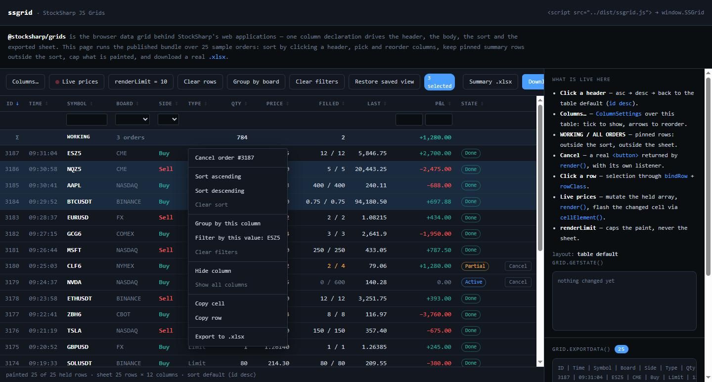

# StockSharp JS Data Grid

[](https://github.com/StockSharp/JS-Grids/actions/workflows/ci.yml)
[](https://www.npmjs.com/package/@stocksharp/grids)
[](LICENSE)

**StockSharp JS Data Grid** is the browser table component behind StockSharp's
web applications: a column-driven `DataGrid` that owns its header, body, column
order, sort, filters, grouping, selection and exported sheet, a `ColumnSettings`
adapter for tables the server already rendered, and a dependency-free `.xlsx`
writer.



[StockSharp website](https://stocksharp.com/) ·
[GitHub repository](https://github.com/StockSharp/JS-Grids) ·
[Issue tracker](https://github.com/StockSharp/JS-Grids/issues)

## Quick start

```sh
npm install @stocksharp/grids
```

```ts
import { DataGrid } from '@stocksharp/grids';

interface Order { id: number; symbol: string; side: number; price: number; }

const grid = new DataGrid<Order>({
  head: document.querySelector<HTMLElement>('#orders thead')!,
  body: document.querySelector<HTMLElement>('#orders tbody')!,
  columns: [
    { key: 'id', header: 'ID', exportable: true, value: (o) => o.id },
    { key: 'symbol', header: 'Symbol', exportable: true, value: (o) => o.symbol },
    {
      key: 'side',
      header: 'Side',
      exportable: true,
      value: (o) => o.side,
      render: (o) => (o.side === 0 ? 'Buy' : 'Sell'),
      cellClass: (o) => (o.side === 0 ? 'side-buy' : 'side-sell'),
      exportValue: (o) => (o.side === 0 ? 'Buy' : 'Sell'),
    },
    { key: 'price', header: 'Price', exportable: true, value: (o) => o.price },
  ],
  defaultSort: { col: 'id', dir: 'desc' },
  rowKey: (o) => String(o.id),
  emptyText: 'No orders',
});

grid.setRows(orders);
grid.download('orders', 'Orders');   // orders-20260807-120000.xlsx
```

The package also ships a ready-to-use browser bundle exposed as `window.SSGrid`:

```html
<script src="https://cdn.jsdelivr.net/npm/@stocksharp/grids@0.1.0/dist/ssgrid.js"></script>
<script>
  const { DataGrid } = window.SSGrid;
</script>
```

## A column is declared once

A blotter used to declare its columns three times — the header cells in markup,
the sort accessors next to the widget, and the header/row arrays in its export —
with nothing keeping the three in step. Here a column states its key, caption,
how to read its value, how to render it, how to class it and whether it exports,
and the grid derives the header, the body, the sort and the sheet from that one
declaration.

Two things a naive column pipeline cannot express are first-class:

- **`render()` may return a `Node`.** A cell can hold a real control with its own
  `addEventListener` instead of an inline `onclick` attribute reaching a global.
  A `DocumentFragment` works too, so a cell can mix text and an element.
- **Pinned rows sit outside the sort and outside the export.** A balance summary
  stays on top whichever column the user sorts by, and never lands in the sheet.
  `pinnedRows()` is re-read on every render, so live figures update.

The grid renders elements, never HTML strings, so nothing in it can be an
injection site. Colour stays with the host: a column returns class names
(`cellClass`, `rowClass`) and the host stylesheet decides what they look like.

Three class names come out of the package itself and an adopting site has to
style them: `grid-empty` on the cell that spans the table when there is nothing
to show, `visually-hidden` on a header whose caption is for screen readers only,
and `sort-asc` / `sort-desc` on the sorted header. The first is ours; the other
two are spelled the way Bootstrap spells them, which is a coupling worth knowing
about before adopting.

`renderLimit` caps what is painted, not what is exported — which is what a
watchlist wants: a screen-sized table over a full sheet. `afterRender()` fires
after every repaint, including one caused by a sort click the caller never saw,
so a host can re-subscribe to the symbols now on screen.

## What the user can do to a table

Everything below is off unless the declaration asks for it, and all of it is in
`getState()` — so a table comes back the way somebody left it.

```ts
const grid = new DataGrid<Order>({
  // ...
  reorderable: true,          // drag a header to move its column
  selection: 'multi',         // 'none' (default) | 'single' | 'multi'
  selectedClass: 'is-selected',
  contextMenu: true,          // the grid's own menu, see below
  onStateChange: (state) => localStorage.setItem('orders', JSON.stringify(state)),
});

grid.setState(JSON.parse(localStorage.getItem('orders') || '{}'));
```

| | |
|---|---|
| `setColumnOrder(keys)` `hideColumn(key)` `showColumn(key)` | the column view, which every render path reads |
| `setFilter(key, filter)` `clearFilters()` | per-column filters — see below |
| `groupBy(key)` `toggleGroup(value)` | single-level grouping, collapsible |
| `setSelection(keys)` `selectedKeys()` `selectedRows()` | selection, held by row key |
| `getState()` `setState(state)` | all of the above, as plain JSON |

Three things about the state are worth knowing before you store it. Unknown column
keys are **dropped rather than rejected**, so a view saved before a deploy that
removed a column still restores the rest. A partial order **keeps the columns it
does not name**, so a stored layout cannot hide a column added later. And
`setState` does **not** fire `onStateChange`, or a store would write itself back
on every page load.

Selection is held by **row key**, not by index or element — which is what makes it
survive a repaint that rebuilds every `<tr>`, and a filter that takes a row off
screen and later brings it back.

## Filters

A column declares which control it wants; the grid draws the row under the header
and does the filtering:

```ts
{ key: 'symbol', header: 'Symbol', filter: 'text',   exportable: true, value: o => o.symbol }
{ key: 'pnl',    header: 'P&L',    filter: 'number', exportable: true, value: o => o.pnl }
{ key: 'board',  header: 'Board',  filter: 'set',    exportable: true, value: o => o.board }
```

A filter is plain data — `{ text }`, `{ min, max }`, `{ values }` — rather than a
predicate, and deliberately so: a closure cannot be written to a store, so a table
filtered by one could never come back filtered the same way. An empty filter is
the same as none, so clearing an input brings the rows back instead of matching
nothing.

## Grouping

```ts
grid.groupBy('board');     // a collapsible header per distinct value, with a count
grid.groupBy(null);        // flat again
```

Groups run in value order while the rows inside each keep the sort the user
picked. `renderLimit` counts rows of data rather than headers, and the export
follows the on-screen order but drops the header rows — a spreadsheet has its own
grouping, and a label row in the middle of the range breaks every formula pointed
at it.

## The context menu

This is the one place the package draws chrome. Everywhere else the host owns it —
the column picker's dialog is the host's markup and its own modal library. A menu
is the exception because positioning a list at a pointer, dismissing it on the
next click and on Escape and keeping it inside the window is the same hundred
lines in every host, and none of them are about tables.



`contextMenu: true` gives you sort, group, filter by the value under the pointer,
hide the column, show all, copy cell, copy row and export. A host can restyle it,
reword it, add to it, or refuse it for a click:

```ts
contextMenu: {
  classes: { menu: 'my-menu', item: 'my-menu-item' },
  labels: { sortAsc: 'По возрастанию' },
  items: (context, defaults) => context.row
    ? [{ label: `Cancel #${context.row.id}`, run: () => cancel(context.row!.id) }, {}, ...defaults]
    : defaults,
}
```

Returning an empty array suppresses the menu for that click — and lets the
browser's own appear, which is what refusing should mean. The grid names the
elements (`grid-menu`, `grid-menu-item`, `grid-menu-separator`, `is-disabled`)
and styles none of them; until your stylesheet describes them, the menu is
invisible.

## Sorting

`TableSort` is the sort state behind the grid, and is usable on its own. Clicking
a `<th data-sort="key">` cycles asc → desc → default: there is no "unsorted"
state, because a table always has a deterministic order. Each table declares its
resting order (`defaultSort`), so a first paint is meaningful instead of exposing
the raw arrival order of a cache hydration, a snapshot and live updates. Rows
with no value for the sorted column sink to the end in both directions, and
`apply()` always returns a copy, so the caller's array is never reordered.

## Server-rendered tables

`ColumnSettings` is the other half: a table the server already rendered, where
the columns exist as markup and the only thing missing is the user's say over
which are shown and in what order. It discovers the columns from the `data-col`
keys the header already carries, and moves and hides cells in place.

It knows nothing about the page it is on — the dialog, the store and the
affordance that opens the picker are all arguments:

```ts
import { ColumnSettings } from '@stocksharp/grids';

const settings = new ColumnSettings({
  table: document.querySelector<HTMLTableElement>('#users')!,
  dialog: {
    list: document.querySelector<HTMLElement>('#column-list')!,
    moveUpTitle: t('Move up'),
    moveDownTitle: t('Move down'),
    classes: {
      item: 'list-group-item d-flex align-items-center gap-2',
      toggle: 'form-check-input',
      label: 'flex-grow-1',
      move: 'btn btn-sm btn-outline-secondary',
      moveUpIcon: 'bi bi-arrow-up',
      moveDownIcon: 'bi bi-arrow-down',
    },
    open: () => modal.show(),
    close: () => modal.hide(),
  },
  store: {
    read: () => new URLSearchParams(location.search).get('columns')?.split(',') ?? null,
    write: (visible) => updateQueryString(visible),
  },
});

// The host owns the dialog chrome — its markup, its buttons, its modal library —
// so the host wires them too. openPicker() only fills the list and shows the
// dialog; without the two below, nothing the user picks can ever be committed.
header.addEventListener('contextmenu', () => settings.openPicker());
confirmButton.addEventListener('click', () => settings.applyPicked());
resetButton.addEventListener('click', () => settings.resetToDefault());
```

`applyPicked()` and `resetToDefault()` each apply the layout, persist it through
the store and call `dialog.close()` — the adapter closes the dialog it was told
how to close, and does nothing else to it.

The table needs a real `<thead>`: a parser inserts a missing `<tbody>` but never
a header, and the columns are only knowable from its cells, so a table without
one is rejected at construction rather than faulting later.

A column with no `data-col` key (an Actions column) is a fixed anchor: it keeps
its slot and is never hidden. A row whose cell count does not match the header (a
colspan "nothing to show" row) is left alone. `write(null)` means "this IS the
table default", so a store that lives in a URL carries its parameter only while
it means something.

## Export

`TableExport.download(baseName, sheetName, headers, rows)` builds a real OOXML
workbook — a store-only ZIP with the minimal SpreadsheetML part set, strings as
inline strings and finite numbers as native numeric cells — so Excel,
LibreOffice and Numbers open it without a conversion warning. No third-party
library is involved, and CSV is never renamed to `.xlsx`.

`DataGrid.download()` routes through it with the exportable columns, every held
row, in the order on screen. `exportData()` returns the same headers and rows
without touching the browser, which is how the sheet's content is asserted in a
test.

## Repository layout

```text
src/
  index.ts             complete public entry point
  data-grid.ts         DataGrid: columns, rendering, pinned rows, export
  table-sort.ts        TableSort: the column-sort state behind the grid
  column-settings.ts   ColumnSettings: column picker for a rendered table
  table-export.ts      TableExport: dependency-free .xlsx writer
tests/                 unit suite plus the fake DOM it runs against
```

## Source-first consumption

Applications can let their own esbuild/Vite build compile the TypeScript
published inside the package:

```json
{
  "dependencies": {
    "@stocksharp/grids": "^0.1.0"
  }
}
```

```ts
import { DataGrid } from '@stocksharp/grids/source';
import { TableExport } from '@stocksharp/grids/source/table-export';
```

`./source` exists for the case where there is nothing compiled to resolve.
`dist/` is a build output and is gitignored, so a checkout of this repository
that has not been built yet ships only `src/` — the `.` and `./data-grid` entry
points point at files that are not there. A consumer that depends on such a
checkout imports through `./source` and lets its own bundler compile the
TypeScript, which is what StockSharp's own web bundles do.

For sibling-repository development, replace the version with a relative path to
the checkout. The depth is whatever the consumer's own location makes it: from
`Broker/Broker.Web.Trader/package.json`, three directories below the workspace
root that holds `Grids/`, it is `"file:../../../Grids"`. The import paths stay
identical either way.

Dedicated entry points are available for consumers with narrower needs:

- `@stocksharp/grids/data-grid` — the grid alone;
- `@stocksharp/grids/table-sort` — sort state without a grid;
- `@stocksharp/grids/column-settings` — the picker for a server-rendered table;
- `@stocksharp/grids/table-export` — the workbook writer on its own.

## Build output

`npm run build` produces:

| File | Purpose |
| --- | --- |
| `dist/esm/**` | complete ESM module tree |
| `dist/types/**` | TypeScript declarations |
| `dist/ssgrid.js` | complete browser IIFE exposed as `window.SSGrid` |

## Commands

```text
npm ci
npm test
npm run build
npm run pack:check
npm run release:patch
npm run release:minor
npm run release:major
npm run api:check
npm run api:update  # only after reviewing an intentional public API change
```

CI verifies type checking, the reviewed declaration snapshot, the unit tests, the
bundles and the tarball contents.

Publishing is driven by the version in `package.json`. `release.yml` runs on
every push to `main` and publishes only when that version is not yet on npm, so
an ordinary push is a no-op. To cut a release, bump the version and push:

```sh
npm run release:patch   # or release:minor / release:major
git push
```

The new version triggers `release.yml`, which rebuilds and tests the repository,
publishes to npm with provenance, then creates the `v<version>` tag and GitHub
Release. A failed publication can be retried from the workflow's `Run workflow`
action; already-published versions are detected and skipped.

Publishing authenticates through npm **trusted publishing (OIDC)** — there is no
`NPM_TOKEN` secret. The workflow grants `id-token: write`, and npm exchanges the
GitHub OIDC token for a short-lived publish token. The npm Trusted Publisher is
bound to the workflow filename `release.yml`, so do not rename that workflow
without updating the trusted publisher configuration on npmjs first.

## License

Copyright © 2010-present StockSharp Platform LLC and/or its affiliates. All
rights reserved. Use is governed by the StockSharp EULA and [LICENSE](LICENSE).
